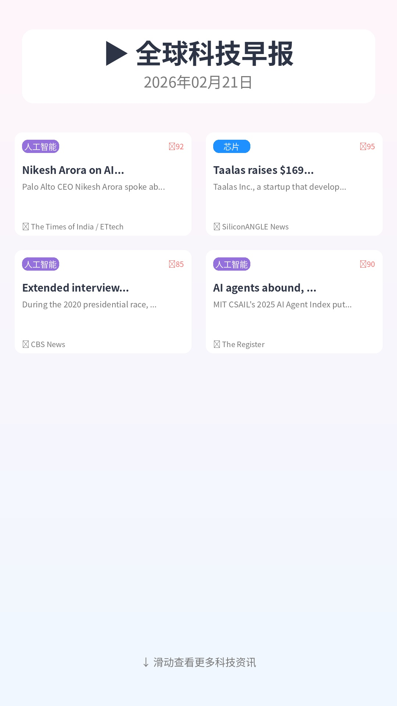
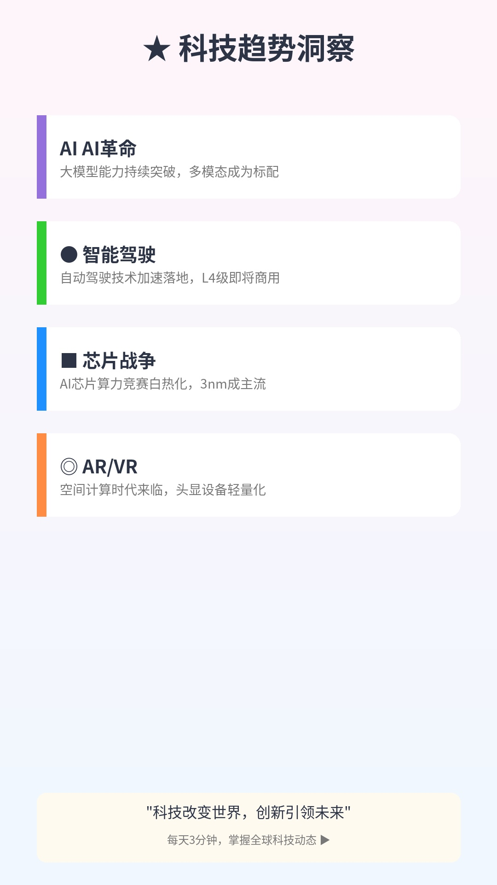

# 🚀 全球科技新闻自动化系统

每天早上8:30自动获取全球高科技公司新闻，生成小红书风格图片。

[](https://github.com/YOUR_USERNAME/tech-news-automation/actions/workflows/daily-news.yml)

## ✨ 功能特点

- 🤖 **自动获取新闻** - 从NewsAPI/GNews获取真实科技新闻
- 🎨 **小红书风格** - 生成精美的3张图片（封面/详情/总结）
- ⏰ **定时运行** - 每天8:30自动执行
- 💰 **完全免费** - 使用GitHub Actions免费额度

## 🚀 快速开始

### 1. Fork本仓库

点击右上角 **Fork** 按钮，将仓库复制到你的账号下

### 2. 配置API密钥

1. 打开仓库的 **Settings** → **Secrets and variables** → **Actions**
2. 点击 **New repository secret**
3. 添加以下Secrets：
   - `NEWSAPI_KEY`: 从 [newsapi.org](https://newsapi.org/) 获取
   - `GNEWS_KEY`: 从 [gnews.io](https://gnews.io/) 获取

### 3. 运行测试

1. 点击仓库顶部的 **Actions** 标签
2. 选择 **Daily Tech News**
3. 点击 **Run workflow** → **Run workflow**
4. 等待执行完成

### 4. 下载图片

- 在Actions运行结果页面，点击 **Artifacts** 下载图片
- 或在 **Releases** 页面查看最新发布

## 📸 生成效果





## ⏰ 定时任务

系统已配置为每天自动运行：

| 时间 | 时区 | 说明 |
|------|------|------|
| 00:30 | UTC | GitHub Actions运行时间 |
| 08:30 | 北京时间 | 中国用户接收时间 |

## 📁 项目结构

```
.
├── .github/workflows/
│   └── daily-news.yml      # GitHub Actions配置
├── scripts/
│   ├── news_fetcher.py     # 新闻获取
│   ├── image_generator.py  # 图片生成
│   └── getnote_sender.py   # Get笔记发送
├── output/                  # 生成的图片
├── main.py                  # 主程序
├── requirements.txt         # Python依赖
└── README.md
```

## 🔧 本地运行

```bash
# 安装依赖
pip install -r requirements.txt

# 配置API密钥
export NEWSAPI_KEY="your_key"
export GNEWS_KEY="your_key"

# 运行测试
python3 main.py --test
```

## 📊 使用限制

| 资源 | 免费额度 | 本系统消耗 |
|------|---------|-----------|
| Actions时间 | 2000分钟/月 | ~90分钟/月 |
| 存储空间 | 500MB | ~50MB/月 |

**免费额度完全够用！**

## 📚 文档

- [GitHub部署指南](GitHub部署指南.md) - 详细部署步骤
- [API配置指南](API配置指南.md) - 获取API密钥
- [使用指南](使用指南.md) - 系统使用说明

## 📝 License

MIT License

---

**每天早上8:30，自动获取最新科技资讯！**
